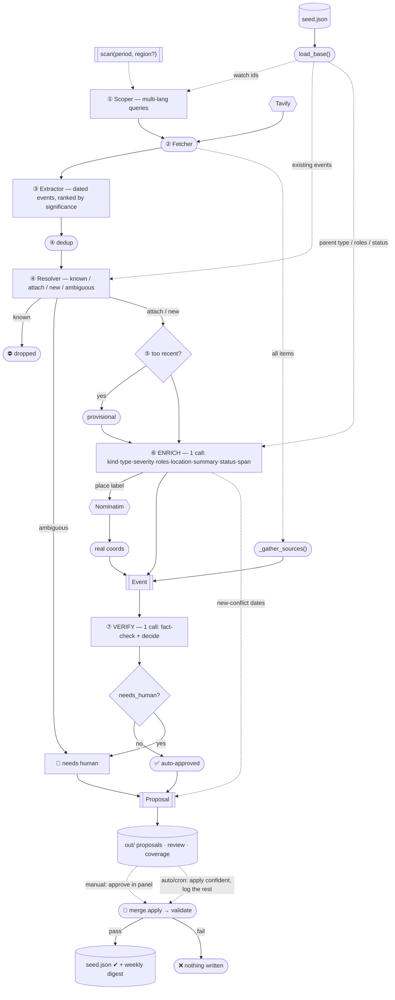

# AI Updater — Pipeline Diagram

The whole `scan → review/auto → apply` loop at a glance. Details live in [ARCHITECTURE.md](ARCHITECTURE.md).

**Legend:** `[box]` = LLM agent · `([rounded])` = deterministic code · `{{hex}}` = external API ·
`[(cyl)]` = file on disk · `{diamond}` = branch · `-->` data flow · `-.->` context supplied alongside.

Per candidate the pipeline makes **3 LLM calls** — `resolver`, `enrich`, `verify` — plus `scoper`
and `extractor` once per scan. (`enrich` batches what used to be seven separate enricher calls;
`verify` batches fact-check + reconcile.)

## The five agents (what each knows)

| Agent | Atlas framing? | Extra context it gets | Output |
|---|---|---|---|
| **Scoper** | ✓ | existing conflict ids to watch | multi-language search queries |
| **Extractor** | ✗ | window bounds | dated candidate events + a significance 1–5 |
| **Resolver** | ✓ ("what the atlas has") | candidate conflicts + **their existing events** | known / attach / new / ambiguous |
| **Enrich** | partial | **today's date**, parent conflict **type + parties/roles + status** | kind·type·severity·roles·location·summary·status·span |
| **Verify** | ✗ | the sources linked to the event | verdict + confidence + independence + auto/human decision |

Deterministic code (no LLM) does the rest: `dedup`, the recency gate, the **Nominatim** geocode,
`_gather_sources` (link every corroborating article), `derive_span` (dates), and `merge`/`validate`.

## Tools

| Tool | Used by | Cost |
|---|---|---|
| **LLM** (OpenRouter / Gemini / OpenAI, swappable) | scoper · extractor · resolver · enrich · verify | free tier (flaky) or ~pennies/wk paid |
| **Tavily** | Fetcher | free tier (~1000/mo) |
| **Nominatim (OpenStreetMap)** | coordinate lookup | free, no key |

## Two ways it runs

- **Manual (control panel):** `serve` → a local dashboard. Run scans, read the review queue, tick
  what you trust, apply into `seed.json`. You're in the loop.
- **Auto (weekly cron):** `auto week` in GitHub Actions → scans, **auto-applies only the confidently
  corroborated findings**, writes a plain-English digest to `log/`, commits + pushes (the live map
  updates). Nothing uncertain is auto-added; everything is reversible via git. No human in the loop.

## Data flow & the invariant

`RawItem` → `CandidateEvent` → `Event` → `Proposal` → folded into `seed.json` by `merge.py`.

Every exit (`dropped`, `needs human`, `nothing written`) is **named and logged** — never a silent
guess. Nothing reaches `seed.json` without `merge.validate()`, and nothing auto-applies without
passing `verify` and the corroboration bar.
