# AI Updater — Pipeline Diagram

A visual companion to [ARCHITECTURE.md](ARCHITECTURE.md). One diagram, the whole
`scan → review → apply` loop: every agent, every tool/API it calls, every context object
it's handed, and what comes out the other end.

## Legend

| Shape | Means |
|---|---|
| `[Rectangle]` | **LLM agent** — a judgment call, one prompt in `prompts.py` |
| `([Rounded])` | **Deterministic code** — no LLM call, no judgment, just logic |
| `{{Hexagon}}` | **External API / tool** — a real network call |
| `[(Cylinder)]` | **Persistent data** — reads/writes a file on disk |
| `{Diamond}` | **Branch point** — a decision with more than one exit |
| solid arrow `-->` | the main data flow (this becomes that) |
| dotted arrow `-.->` | **context supplied alongside** — reference material, not the primary payload |

---

## The full diagram

```mermaid
flowchart TD
    IN[["📥 scan(period, region?, topic?)\nthe ONLY input — a week or a century, same path"]]

    SEEDFILE[("seed.json\n~250 conflicts, ~400+ events")]
    BASE("load_base()\nBaseConflict index per conflict:\nid · title · type · aliases\ninvolvedCountries · parties+roles\nstatus (inferred if missing) · start/end\n+ its existing events (date+title)")
    SEEDFILE --> BASE
    IN -.->|"window, region, topic"| SCOPER

    subgraph S1["① SCOPER — LLM"]
        SCOPER["Scoper agent\nwindow → ≤6 multi-language search queries\n+ watch_conflict_ids (existing conflicts to re-check)"]
    end
    BASE -.->|"conflict ids to watch"| SCOPER

    subgraph S2["② FETCHER — code"]
        TAVILY{{"Tavily Search API"}}
        FETCHER(["Fetcher\nruns every query, dedupes by URL"])
        TAVILY --> FETCHER
    end
    SCOPER -->|"SearchQuery[] (query, lang)"| FETCHER

    subgraph S3["③ EXTRACTOR — LLM"]
        EXTRACTOR["Extractor agent\nraw articles → discrete, DATED candidate events\n(one per real happening; ignores opinion/undated)"]
    end
    FETCHER -->|"RawItem[]\ntitle · url · snippet · lang · outlet · alignment"| EXTRACTOR

    subgraph S4["④ RESOLVER — code + LLM"]
        DEDUP(["dedup.find_candidates()\nfuzzy title/alias + token overlap\n+ actor hit + date-range penalty\n(deterministic score, top-5)"])
        RESOLVER["Resolver agent\nknown · attach · new · ambiguous\nmatches on MEANING across languages"]
        DEDUP --> RESOLVER
    end
    EXTRACTOR -->|"CandidateEvent\ndate·title·action·actors·place·source_urls"| DEDUP
    BASE -.->|"candidate conflicts +\ntheir existing events\n(known-vs-gap context)"| RESOLVER

    RESOLVER -->|"known"| DROPPED(["⛔ DROPPED\n(any new source URLs kept)"])
    RESOLVER -->|"ambiguous"| H1["🧑 HUMAN REVIEW"]

    subgraph S5["⑤ RECENCY GATE — code"]
        GATE{"event date within\nT_SETTLE_DAYS of today?"}
    end
    RESOLVER -->|"attach / new"| GATE
    GATE -->|"yes"| PROVFLAG(["provisional = true\n(held until it corroborates)"])
    GATE -->|"no"| ENRICH_IN

    PROVFLAG --> ENRICH_IN(("candidate proceeds\nto enrichment"))

    subgraph S6["⑥ ENRICHERS — LLM, one lane each"]
        CLASSIFIER["Classifier\nevent KIND (mapped from real phrasing)\nconflict TYPE only if new\n— must not contradict parent type"]
        SEVERITY["Severity\n1-5, anchored rubric\n(invasion≥3, massacre 4-5, treaty~1)"]
        ROLES["Roles\nSTRUCTURAL, not per-event —\nreuses the parent conflict's\nexisting parties+roles"]
        GEO["Geolocator\nnames a PLACE only\n(no coordinates from memory)"]
        SUMMARY["Summarizer\nneutral, 1-2 sentences,\nattributes contested claims"]
        LIFECYCLE["Lifecycle\nONLY called if this is the latest\nevent, or a new conflict —\nelse status is inherited, no call"]
        SPAN["Span\nONLY for a NEW conflict —\nreads start/end dates from sources;\nderive_span() merges with event min/max"]
    end
    ENRICH_IN --> CLASSIFIER & SEVERITY & ROLES & GEO & SUMMARY
    ENRICH_IN -->|"is_latest_event? / is_new?"| LIFECYCLE
    ENRICH_IN -->|"is_new only"| SPAN
    SPAN -.->|"start/end for the new conflict"| PROPOSAL
    BASE -.->|"parent type"| CLASSIFIER
    BASE -.->|"parent type + existing parties/roles"| ROLES
    BASE -.->|"current status, start/end,\ntoday's date"| LIFECYCLE

    subgraph S6B["real coordinates — code, no LLM"]
        NOMINATIM{{"Nominatim /\nOpenStreetMap API"}}
    end
    GEO -->|"place label"| NOMINATIM
    NOMINATIM -->|"lat/lng found"| LOCATION(("Location\n(falls back to the LLM's\nown guess only on a miss)"))
    GEO -.->|"guess — fallback only"| LOCATION

    subgraph S6C["source linking — code, no LLM"]
        GATHER(["_gather_sources()\nlinks EVERY fetched item that\ncorroborates this event\n(token overlap + date match),\ntags outlet/lang/alignment"])
    end
    FETCHER -.->|"all ~40-50 fetched items\n(not just the 1 it was\nextracted from)"| GATHER

    CLASSIFIER --> EVENT
    SEVERITY --> EVENT
    ROLES --> EVENT
    LOCATION --> EVENT
    SUMMARY --> EVENT
    GATHER --> EVENT
    LIFECYCLE --> EVENT
    EVENT[["Event\ndate · title · kind · severity\nlocation · parties · description\nsources[] (url+outlet+lang+alignment)"]]

    subgraph S7["⑦ FACT-CHECK — LLM"]
        FC["Fact-check agent\ncounts INDEPENDENT sources\nchecks CROSS-ALIGNMENT agreement\nverdict: pass / fail / uncertain + confidence"]
    end
    EVENT --> FC

    subgraph S8["⑧ RECONCILER — LLM"]
        REC["Reconciler agent\nauto_approve or needs_human\n+ a one-line open_question"]
    end
    FC --> REC

    REC --> DECISION{"needs_human =\nambiguous OR is_new OR\nfail/uncertain OR low confidence?"}
    DECISION -->|"yes"| H2["🧑 HUMAN REVIEW"]
    DECISION -->|"no"| AUTO(["✅ auto-approved"])

    H1 --> PROPOSAL
    H2 --> PROPOSAL
    AUTO --> PROPOSAL
    PROPOSAL[["Proposal\nkind · target_conflict_id · event\nroles · status · factcheck · reconcile\nneeds_human · provisional"]]

    PROPOSAL --> PJSON[("out/proposals_*.json")]
    PROPOSAL --> REVIEWMD[("out/review_*.md\n(human-readable queue)")]

    REVIEWMD -.->|"you read it"| YOUAPPROVE(["you edit proposals_*.json:\nneeds_human → false on what you accept"])
    PJSON --> YOUAPPROVE

    subgraph S9["🔀 apply() — code, no LLM"]
        MERGE(["merge.apply()\nattach → append+resort, RAISE severity,\nunion countries/aliases, add new party+role,\nstatus changes ONLY from the latest event\nnew_conflict → convert snake_case→app JSON, append"])
        VALIDATE{"merge.validate()\nparties⊆involvedCountries · valid dates\nseverity 1-5 · no ongoing&&ended"}
        MERGE --> VALIDATE
    end
    YOUAPPROVE --> MERGE

    VALIDATE -->|"pass"| SEEDOUT[("seed.json\nupdated, version bumped")]
    VALIDATE -->|"fail"| REJECTED(["❌ nothing written, exit non-zero"])
```

---

## What each agent is actually handed (the "is it blind?" table)

| Agent | Gets the mission/atlas framing? | Context beyond the bare event |
|---|---|---|
| Scoper | ✓ ("plan research for a conflict atlas") | existing conflict ids to watch |
| Fetcher | — (code) | — |
| Extractor | ✗ | the window's date bounds only |
| Resolver | ✓ ("what the atlas ALREADY HAS") | candidate conflicts + **their existing events** |
| Classifier | ✗ | parent conflict's **type** (must not contradict it) |
| Severity | ✗ | evidence snippets only |
| Roles | ✗ | parent conflict's **type + existing parties/roles** (must not flip them) |
| Geolocator | ✗ | — (names a place; coordinates come from Nominatim, not the LLM) |
| Summarizer | ✓ ("for an atlas") | evidence snippets |
| Lifecycle | ✗ | **today's date**, event date, conflict start/end, current status |
| Fact-check | ✗ | the sources actually linked to this event |
| Reconciler | ✗ | the fact-check verdict |

Only 3 of 11 steps say "this is for a conflict atlas" explicitly — the rest work from the
taxonomy + whatever specific context is passed in. (Flagged as a possible follow-up: a
shared one-paragraph mission preamble injected into every prompt, not just three.)

## Tools / external APIs in play

| Tool | Used by | Cost | Notes |
|---|---|---|---|
| **LLM** (OpenRouter / Gemini / OpenAI — swappable) | every `[Rectangle]` agent above | free tier or pennies | `llm.py`; free models use a prompted-JSON fallback since they often ignore native structured output |
| **Tavily Search** | Fetcher | free tier (~1000/mo) | `search.py`; the pipeline's only way to see anything after its training cutoff |
| **Nominatim (OpenStreetMap)** | real coordinate lookup | free, no key | `geocode.py`; rate-limited to ~1 req/sec per its usage policy |

## Data objects, in the order they're built

`RawItem` (a fetched article) → `CandidateEvent` (extracted, undecided) → `Event` (fully
enriched: kind/severity/roles/location/sources) → `Proposal` (an `Event` plus its
routing decision) → folded into `seed.json`'s `Conflict.events[]` by `merge.py`.

## The one invariant that runs through all of it

Every branch point above (`DROPPED`, `H1`, `H2`, `REJECTED`) is a **named, logged exit** —
never a silent guess. Nothing reaches `seed.json` without passing `merge.validate()`, and
nothing reaches auto-approval without passing fact-check + the reconciler.
