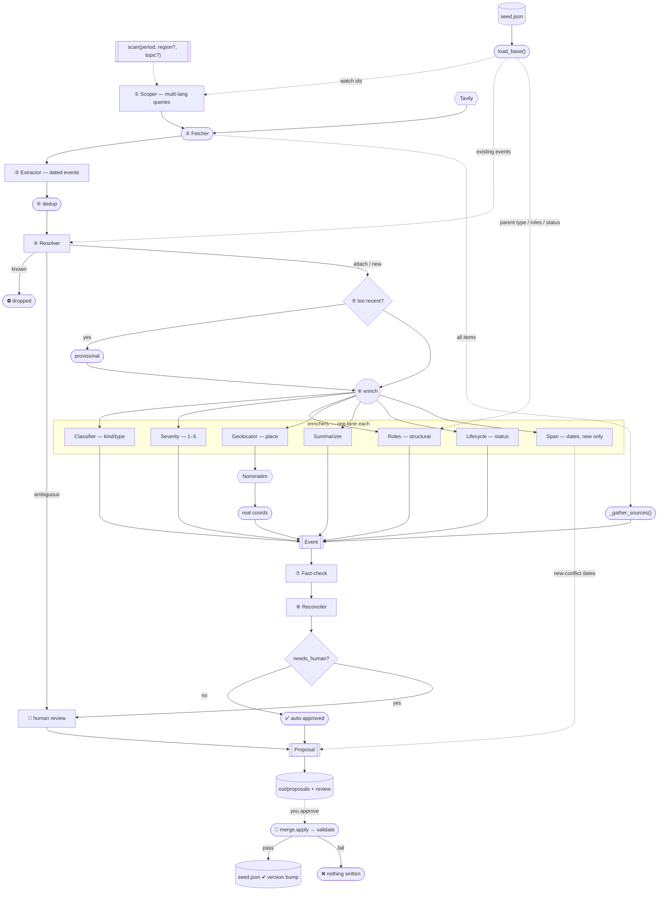

# AI Updater — Pipeline Diagram

The whole `scan → review → apply` loop at a glance. Details live in [ARCHITECTURE.md](ARCHITECTURE.md).

**Legend:** `[box]` = LLM agent · `([rounded])` = deterministic code · `{{hex}}` = external API ·
`[(cyl)]` = file on disk · `{diamond}` = branch · `-->` data flow · `-.->` context supplied alongside.

## Does each agent know the goal? (the "is it blind?" table)

| Agent | Atlas framing? | Extra context it gets |
|---|---|---|
| Scoper | ✓ | existing conflict ids to watch |
| Extractor | ✗ | the window's date bounds |
| Resolver | ✓ | candidate conflicts + **their existing events** |
| Classifier | ✗ | parent conflict's **type** |
| Severity | ✗ | evidence snippets |
| Roles | ✗ | parent **type + existing parties/roles** |
| Geolocator | ✗ | — (names a place; Nominatim gives the coords) |
| Summarizer | ✓ | evidence snippets |
| Lifecycle | ✗ | today, event date, conflict start/end, status |
| Span | ✗ | source snippets (new conflicts only) |
| Fact-check | ✗ | the sources linked to the event |
| Reconciler | ✗ | the fact-check verdict |

Only 3 of 12 steps state the mission explicitly — a shared mission preamble is a possible follow-up.

## Tools

| Tool | Used by | Cost |
|---|---|---|
| **LLM** (OpenRouter / Gemini / OpenAI, swappable) | every agent | free tier or pennies |
| **Tavily** | Fetcher | free tier (~1000/mo) |
| **Nominatim (OpenStreetMap)** | coordinate lookup | free, no key |

## Data flow

`RawItem` → `CandidateEvent` → `Event` → `Proposal` → folded into `seed.json` by `merge.py`.

**The invariant:** every exit (`dropped`, `human review`, `nothing written`) is named and logged —
never a silent guess. Nothing reaches `seed.json` without `merge.validate()`, and nothing
auto-approves without passing fact-check + the reconciler.
